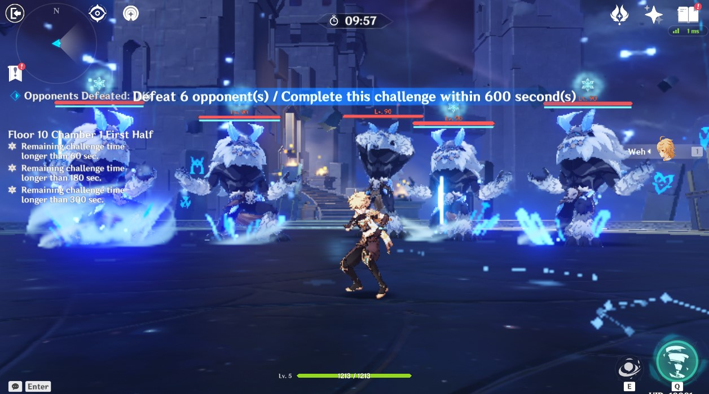

# SceneHook
Hook group replacement to any scene.

## How it works
Given scene group scripts in SceneHook's plugin data folder

```
plugins/SceneHook/Scene
└── <sceneId>
    ├── replacement.json
    ├── scene<sceneId>_group<groupId1>.lua
    ├── scene<sceneId>_group<groupId2>.lua
    ...
```

where `replacement.json` provides replacement IDs

```json
{
  "replacements":
  [
    {
      "replacedSceneGroup": oldGroupId1,
      "newSceneGroup": newGroupId1
    },
    {
      "replacedSceneGroup": oldGroupId2,
      "newSceneGroup": newGroupId2
    },
    ...
  ]
}
```

SceneHook adds listeners for the following events:

| Event | Called when | Action |
|-|-|-|
| SceneBlockLoadedEvent | SceneBlock finishes reading from block script | Setup old groups for replacement by new groups |
| SceneMetaLoadEvent | SceneScriptManager starts loading SceneMeta | Hook dynamic group loads into scene |

## Example
As of Grasscutter 1.7.2, Abyss is at schedule 45. See `scheduleId` in grasscutter/data/TowerSchedule.json.

Cross-referencing between
* TowerLevelExcelConfigData.json
* TowerScheduleExcelConfigData.json
* TowerFloorExcelConfigData.json
* DungeonExcelConfigData.json

we find that Floor 10 Chamber 1 has scene ID 33718. Scripts operating this scene are in GC-Resources/Resources/Scripts/Scene/33718

Let's change the mobs in this chamber.

These mobs had been sourced from `scene33718_group233718007.lua`:


To change the mobs, we can make a duplicate of `scene33718_group233718007.lua`, name it `scene33718_group233718107.lua`, and edit the monster IDs within.

Then change the dungeon operator (the floating key) to load the new group instead of the old one.


This key is spawned from `scene33718_group233718006.lua`. Duplicate it into `scene33718_group233718106.lua` and edit it to add group 233718107 instead of the original 233718007:

```diff
-	    ScriptLib.AddExtraGroupSuite(context, 233718007, 2)
+	    ScriptLib.AddExtraGroupSuite(context, 233718107, 2)
```

Afterwards, tell SceneHook about these new groups and the old groups to replace in a replacement.json:

```json
{
  "replacements":
  [
    {
      "replacedSceneGroup": 233718006,
      "newSceneGroup": 233718106
    },
    {
      "replacedSceneGroup": 233718007,
      "newSceneGroup": 233718107
    }
  ]
}
```

Put the new lua scripts and replacement.json in SceneHook's plugin data folder:

```
plugins/SceneHook/Scene
└── 33718
    ├── replacement.json
    ├── scene33718_group233718106.lua
    └── scene33718_group233718107.lua
```

Finally, tell SceneHook to automatically hook these replacements when first loading scene 33718:

```json
{
  "hookScenesOnPluginEnable":
  [
    33718
  ]
}
```

Put this json in the plugin data folder: `plugins/SceneHook/onEnable.json`.

Restart Grasscutter to load SceneHook again. Et voila!



# Version
The plugin is currently on Grasscutter version `1.7.3`.